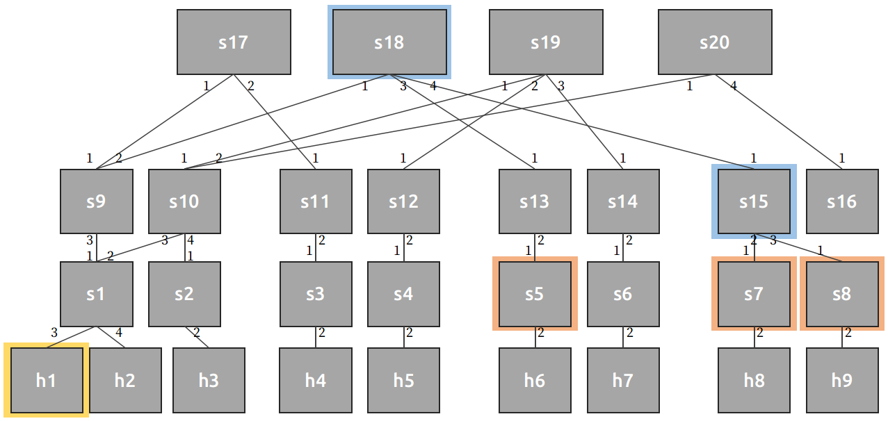

# Spanning tree

## Introduction

Spanning tree aims to reduce the control plane routing rules installed on forwarders,
keeping forwarder a nice O(1) space complexity (while aggregator being O(N), and
monitor O(N) too).

With current setting, including nested/mono aggr and even every flow_aggregator_X,
we adopt IP-based forwarding (or qID-based, but they are fundamentally the same).
Such implementation will always incur O(N) control plance table cost on forwarder.
We have several ways to deal with it:

1. Move the routing tables from forwarders to aggregator(s)

  With nested aggregator, we can encapsulate source routing info while aggregator
mcasting. However, this will reduce the amount of maximum aggregator, which is
already a precious resource shared temporary. That is, we are actually moving the
load from forwarders to aggregators, which is an undesired event.

2. Source routing + multicasting

  We encapsulate all the necessary routing info in control packet, including unicast port
(for forwarders) and mulicast ports (for aggrgators). However, with the introduction of
multicast, the routing is now a imbalanced tree, and we would had to compress and
decompress the tree on the programmable switch. Unlike normal programming,
programming with P4's limited semantic is ~a pain in the ass~ hard to do, not to
mention the tree size could easily be too large to fit into the switch parser maximum.

3. Spanning tree

  Spanning tree method could be though of as an back-off baseline for previous
`Source routing + multicasting`. We first construct a tree which from collector to
all potential monitors (literally every switch) without any loop. Then every time the
collector have to send out control message (i.e. poll requst and its response), it will
literally bcast through the whole tree no matter which query it is. Therefore, we can
make sure that on every forwarder, there would only be two forwarding rules.

> Yes, at the cost of flooding the network

Yes, and we finally choose to implement spanning tree since it is more feasible.

## Details about spanning tree

1. Source-routing for responses

  Unlike normal packets, collector requests should always be echo back from monitors.
It would be fine for IP-based routing, we would only have to swap the dst and src, and
hand it into the network. However, in our mulicasted-based spanning tree (and also
source routing) there would be no routing info for response.

  Although we could bcast all way back, it seems really ~stupid~ expensive to do so.
As a result, we could have the header field record the response route, which is actually
in a reversed order of ingress port for requests.

  So we only apply bcast on requests, but source-routing on responses.

2. TTL trying to make up for flooding cost

  As a redemption for flooding the network, we could at least apply (maximum) TTL for
requests, which indicates the most mcast hop. If the monitor only locates on non-edge
switches, then we could potentially reduce some unnecessary bcast.

> Yes, I am really sorry about bcasting, but I had no choice.

3. Multiple queries

### Simple demo with manual setting
- Balanced
  1. 2 monitor: (3, 4), (3, 5), (3, 6) ...
  2. 3 monitor: (1, 3, 6), (1, 4, 8), (3, 4, 5), (5, 7, 8)
  3. 4 monitor: (1, 3, 5, 6), (3, 4, 5, 7), (4, 6, 7, 8), (1, 3, 4, 5), (1, 3, 7, 8)

- Imbalanced:
  1. 2 monitor:
  2. 3 monitor:
  3. 4 monitor:

## Information Plane

#### Control Plane

Responsible for
- Routing
- Aggregation bitmap prefix and forward threshold
